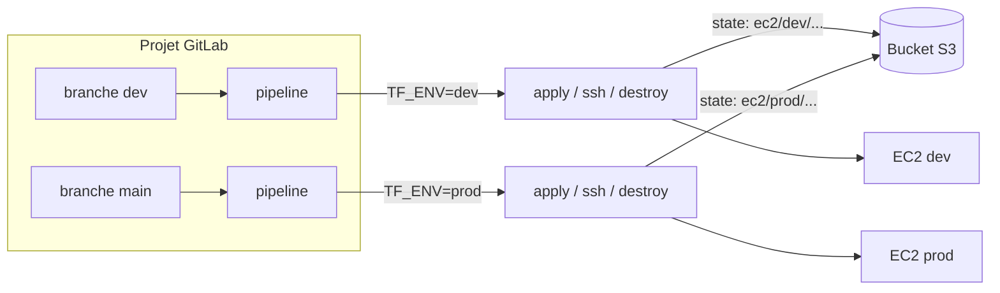

# 7 — Un pipeline GitLab qui provisionne un EC2 (dev / prod)

> **Scénario à réaliser en autonomie.** Vous allez créer un projet GitLab, y poser votre
> logique Terraform dans `ops/terraform/`, et brancher un **pipeline CI/CD** qui, à la
> demande, provisionne un serveur **EC2**, s'y **connecte en SSH**, puis le **détruit** —
> avec **deux environnements** (`dev` et `prod`) portés par **deux branches** (`dev` et
> `main`). Vous remplissez vous-même les `# TODO` ; le dossier `solution/` n'est qu'un
> **dernier recours** en cas de blocage 😉.

**Niveau : intermédiaire.** On suppose que vous maîtrisez déjà les bases de Terraform vues
aux chapitres précédents (`init` / `plan` / `apply` / `destroy`, variables, backend S3 — cf.
[4-STATE](../00-labs/4-STATE.md) et l'exemple [06-aws-terraform-intro-simple-ec2](../06-aws-terraform-intro-simple-ec2/)),
ainsi que les bases de Git. On **n'assume pas** que vous connaissez GitLab CI/CD : c'est
précisément ce que ce chapitre vous apprend.

### Ressources utiles

- [GitLab CI/CD — `.gitlab-ci.yml`](https://docs.gitlab.com/ci/yaml/) ·
  [Variables CI/CD](https://docs.gitlab.com/ci/variables/) ·
  [Environnements](https://docs.gitlab.com/ci/environments/)
- [Terraform dans GitLab](https://docs.gitlab.com/user/infrastructure/iac/) ·
  [Backend S3](https://developer.hashicorp.com/terraform/language/backend/s3) ·
  [`-backend-config` (backend partiel)](https://developer.hashicorp.com/terraform/language/backend#partial-configuration)
- [`aws_key_pair`](https://registry.terraform.io/providers/hashicorp/aws/latest/docs/resources/key_pair) ·
  [`aws_instance`](https://registry.terraform.io/providers/hashicorp/aws/latest/docs/resources/instance)

---

## ✨ Objectifs

- Créer un projet GitLab avec **deux branches** `dev` et `main` = **deux environnements**.
- Écrire la logique Terraform (EC2 + security group + key pair) dans **`ops/terraform/`**.
- Stocker le **state dans un backend S3 distant**, avec **une clé de state par environnement**.
- Ranger les **secrets** (credentials AWS + clés SSH) dans les **variables CI/CD masquées** —
  jamais dans le repo.
- Construire un pipeline **simple** : `apply` (manuel) → `ssh` → `destroy` (manuel).

---

## 🗺️ L'architecture visée

Regardons d'abord où l'on va, car deux idées structurent tout le reste : **une branche = un
environnement**, et **un environnement = un state S3 isolé**. C'est ce qui permet de déployer
`dev` sans jamais toucher à `prod`, alors que le **même code** Terraform sert les deux.



**Pourquoi un state par environnement ?** Si `dev` et `prod` partageaient le même fichier de
state, un `apply` sur `dev` écraserait la description de `prod` (mêmes ressources logiques,
`aws_instance.srv`) — on détruirait la prod sans le vouloir. On isole donc chaque environnement
dans **sa propre clé de state** dans le bucket : `ec2/dev/terraform.tfstate` vs
`ec2/prod/terraform.tfstate`. Le **bucket** est partagé, la **clé** ne l'est pas.

**Pourquoi porter l'environnement par la branche ?** Parce que GitLab exécute déjà un pipeline
par branche, et sait déduire de la branche courante (`$CI_COMMIT_REF_NAME`) l'environnement
cible. Pas de duplication de code : `dev` et `main` lancent le **même** `.gitlab-ci.yml`, seul
un `var-file` et une clé de state changent.

---

## 📁 Point de départ / arborescence cible

Vous partez d'un **projet GitLab vide** (voir section 1). À la fin, votre dépôt ressemblera à
ceci — vous créez tous ces fichiers vous-même au fil des sections :

```
mon-projet-gitlab/
├── .gitlab-ci.yml                 # le pipeline (section 4)
└── ops/
    └── terraform/
        ├── providers.tf           # backend S3 + provider AWS (sections 1 & 2)
        ├── variables.tf           # (section 1)
        ├── main.tf                # VPC + AMI + key pair + SG + instance (section 1)
        ├── outputs.tf             # IP, DNS, URL, commande SSH (section 1)
        └── environments/
            ├── dev.tfvars         # paramètres de l'env dev (section 1)
            └── prod.tfvars        # paramètres de l'env prod (section 1)
```

> ℹ️ Les **secrets** (credentials AWS, clés SSH) ne sont **pas** dans cette arborescence :
> ils vivent dans GitLab (**Settings → CI/CD → Variables**), voir section 3.

---

## 🦊 1 — Créer le projet GitLab et les deux branches

Votre formateur vous fournit un **compte / utilisateur** GitLab. On commence par le dépôt et
les deux branches qui matérialisent les deux environnements.

1. Sur GitLab, **New project → Create blank project**. Décochez « Initialize with a README »
   si vous partez d'un dossier local, ou laissez-le coché et clonez.
2. Clonez le projet en local, puis créez la branche `dev` **à partir de** `main` :

🚧 **À compléter :**

```bash
git clone <url-de-votre-projet>.git
cd <votre-projet>

# main existe déjà ; on crée dev à partir d'elle
git switch -c dev
# TODO : pousser la branche dev vers le dépôt distant (indice : git push -u ...)
```

> 📖 [git switch](https://git-scm.com/docs/git-switch) ·
> [Branches par défaut GitLab](https://docs.gitlab.com/user/project/repository/branches/default/)

Vous avez maintenant **deux branches** : `main` (→ `prod`) et `dev` (→ `dev`). On y reviendra
en section 4 : c'est la branche courante qui décidera de l'environnement.

---

## 🌍 2 — La logique Terraform dans `ops/terraform/`

Le cœur du lab reprend l'EC2 minimal de
[06-aws-terraform-intro-simple-ec2](../06-aws-terraform-intro-simple-ec2/) : **VPC par défaut**,
**dernière AMI Amazon Linux 2023**, un **security group** (SSH + HTTP) et une **instance**. Deux
différences importantes, adaptées à la CI :

| Choix | Pourquoi |
|---|---|
| La **key pair est créée par Terraform** (`aws_key_pair`) à partir d'une **clé publique** fournie en variable | Aucune clé à pré-créer à la main dans la console AWS ; la clé publique arrive d'un secret CI/CD (section 3) |
| Le provider AWS **ne contient aucune credential** | En CI, on injecte `AWS_ACCESS_KEY_ID` / `AWS_SECRET_ACCESS_KEY` en variables d'environnement, que le provider **et** le backend S3 lisent tout seuls |

Créez `ops/terraform/variables.tf` :

🚧 **À compléter :**

```hcl
variable "aws_region" {
  type    = string
  default = "eu-west-3"
}

variable "environment" {
  description = "Nom de l'environnement (dev / prod)"
  type        = string
  # TODO : pas de default -> la valeur vient du var-file (section 4)
}

variable "instance_type" {
  type    = string
  default = "t3.micro"
}

# TODO : déclarer une variable "ssh_public_key" (type string, sensitive optionnel)
#        -> elle recevra la clé publique SSH depuis le secret CI/CD SSH_PUBLIC_KEY
```

Créez `ops/terraform/main.tf` (VPC + AMI + key pair + SG + instance) :

🚧 **À compléter :**

```hcl
data "aws_vpc" "default" {
  default = true
}

data "aws_ami" "al2023" {
  most_recent = true
  owners      = ["amazon"]
  filter {
    name   = "name"
    values = ["al2023-ami-2023.*-x86_64"]
  }
}

# TODO : resource "aws_key_pair" "lab" -> key_name unique par env
#        (ex: "aelion-2609-${var.environment}") et public_key = var.ssh_public_key

resource "aws_security_group" "ec2_sg" {
  name        = "aelion-2609-${var.environment}-sg"
  description = "Allow SSH and HTTP inbound traffic"
  vpc_id      = data.aws_vpc.default.id

  # TODO : ingress 22 (SSH) et 80 (HTTP) depuis 0.0.0.0/0, egress tout ouvert
}

resource "aws_instance" "srv" {
  ami                    = data.aws_ami.al2023.id
  instance_type          = var.instance_type
  # TODO : rattacher la key pair (key_name) et le security group (vpc_security_group_ids)

  # nginx pour avoir quelque chose à voir, avec le nom de l'env dans la page
  user_data = <<-EOF
    #!/bin/bash
    dnf install -y nginx
    echo "<h1>Aelion 2609 - environnement ${var.environment}</h1>" > /usr/share/nginx/html/index.html
    systemctl enable --now nginx
  EOF

  tags = {
    Name        = "aelion-2609-${var.environment}"
    Environment = var.environment
  }
}
```

Créez `ops/terraform/outputs.tf` — au minimum `public_ip` et `web_url` (le pipeline les lit) :

🚧 **À compléter :**

```hcl
output "public_ip" {
  value = aws_instance.srv.public_ip
}

# TODO : output "web_url" = "http://${aws_instance.srv.public_ip}"
# TODO (bonus) : public_dns, ssh_command
```

Enfin, **un var-file par environnement** dans `ops/terraform/environments/` :

🚧 **À compléter :**

```hcl
# environments/dev.tfvars
environment   = "dev"
instance_type = "t3.micro"

# environments/prod.tfvars
environment   = "prod"
# TODO : donner un type un peu plus costaud à la prod (ex: t3.small)
```

> 📖 [`aws_key_pair`](https://registry.terraform.io/providers/hashicorp/aws/latest/docs/resources/key_pair) ·
> [`aws_ami` (data)](https://registry.terraform.io/providers/hashicorp/aws/latest/docs/data-sources/ami) ·
> [Fichiers de variables `-var-file`](https://developer.hashicorp.com/terraform/language/values/variables#variable-definitions-tfvars-files)

---

## 🗄️ 3 — Le backend S3, une clé de state par environnement

On veut le **même code** pour `dev` et `prod`, mais **deux states séparés**. L'astuce : un
**backend partiel**. On déclare dans le code tout ce qui est commun (bucket, region), et on
**laisse la clé `key` de côté** — elle sera fournie au `terraform init` par le pipeline, selon
la branche.

| Champ backend | Où on le met | Pourquoi |
|---|---|---|
| `bucket`, `region` | dans `providers.tf` | commun aux deux environnements |
| `use_lockfile = true` | dans `providers.tf` | verrou natif S3 (pas besoin de DynamoDB) — demande Terraform **≥ 1.10** |
| `key` | **absent** du code, injecté au `init` | c'est LUI qui diffère : `ec2/dev/...` vs `ec2/prod/...` |

Complétez `ops/terraform/providers.tf` :

🚧 **À compléter :**

```hcl
terraform {
  required_version = ">= 1.10"

  backend "s3" {
    bucket       = "aelion-2609-borisn"   # TODO : le nom de VOTRE bucket S3
    region       = "eu-west-3"
    use_lockfile = true
    # NOTE : pas de "key" ici -> injectée au init (section 4)
  }

  required_providers {
    aws = {
      source  = "hashicorp/aws"
      version = "~> 6.0"
    }
  }
}

# TODO : provider "aws" avec seulement region = var.aws_region
#        (surtout PAS de access_key/secret_key : ils viennent des variables d'env)
```

> 📖 [Backend S3 — partial configuration](https://developer.hashicorp.com/terraform/language/backend#partial-configuration) ·
> [S3 state locking `use_lockfile`](https://developer.hashicorp.com/terraform/language/backend/s3#state-locking)
>
> ⚠️ **Prérequis :** le **bucket S3 doit déjà exister** (le backend ne le crée pas). Réutilisez
> votre bucket des chapitres précédents, ou créez-en un une fois avec l'AWS CLI :
> `aws s3 mb s3://votre-bucket --region eu-west-3`.

---

## 🔐 4 — Les secrets dans GitLab (AWS + clés SSH)

On ne met **jamais** un secret dans le repo. GitLab les stocke à part, chiffrés, et les injecte
dans les jobs comme variables d'environnement. Direction **Settings → CI/CD → Variables**.

D'abord, générez une **paire de clés SSH dédiée au lab** (ne réutilisez pas votre clé perso) :

```bash
ssh-keygen -t ed25519 -f ./aelion-2609 -N ""
# crée aelion-2609 (privée) et aelion-2609.pub (publique)
```

Puis créez ces **cinq variables** (Settings → CI/CD → Variables → *Add variable*) :

| Variable | Type | Valeur | Options |
|---|---|---|---|
| `AWS_ACCESS_KEY_ID` | Variable | votre access key | ✅ Masked, ✅ Protected |
| `AWS_SECRET_ACCESS_KEY` | Variable | votre secret key | ✅ Masked, ✅ Protected |
| `AWS_DEFAULT_REGION` | Variable | `eu-west-3` | ✅ Protected |
| `SSH_PUBLIC_KEY` | Variable | contenu de `aelion-2609.pub` | ✅ Protected |
| `SSH_PRIVATE_KEY` | **File** | contenu de `aelion-2609` (la privée) | ✅ Protected |

> 💡 **Deux détails qui piègent tout le monde :**
> - **`SSH_PRIVATE_KEY` est de type `File`** : GitLab écrit sa valeur dans un fichier temporaire
>   et met le **chemin** de ce fichier dans la variable. Dans le job, on fait donc
>   `ssh -i "$SSH_PRIVATE_KEY" ...` (le chemin), pas la clé elle-même.
> - **`Masked` refuse les valeurs multi-lignes** : c'est pour ça que la clé privée est en type
>   `File` (non masquable) et pas en `Variable` masquée.

**Un mot sur `Protected`.** Une variable *protected* n'est exposée qu'aux pipelines des
**branches/tags protégés**. Comme on veut que `dev` fonctionne aussi, **protégez les deux
branches** : **Settings → Repository → Protected branches** → ajoutez `dev` (en plus de `main`).
Sinon les jobs sur `dev` n'auront pas les secrets et `terraform init` échouera avec un
`NoCredentialProviders`.

> 📖 [Variables CI/CD (masked, protected, file)](https://docs.gitlab.com/ci/variables/#define-a-cicd-variable-in-the-ui) ·
> [Branches protégées](https://docs.gitlab.com/user/project/protected_branches/)
>
> 🏢 **En entreprise**, on ne colle pas des clés AWS statiques : on utilise
> [OIDC](https://docs.gitlab.com/ci/cloud_services/aws/) (GitLab s'authentifie auprès d'AWS sans
> secret long terme). Pour le lab, les clés en variables suffisent — c'est la même logique que
> les secrets `TF_VAR_*` évoqués en [6-ONDEMAND-ENV](../00-labs/6-ONDEMAND-ENV.md).

---

## ⚙️ 5 — Le pipeline `.gitlab-ci.yml`

On y arrive. Le pipeline doit faire, **selon la branche** :

- `fmt-validate` + `plan` → **automatiques** (à chaque push sur `dev` ou `main`) ;
- `apply` → **manuel** (bouton dans l'UI) ;
- `ssh` → **manuel** (se connecte et vérifie) ;
- `destroy` → **manuel** (bouton).

### 5.1 — Le point délicat : passer l'environnement au bon endroit

On veut une variable `TF_ENV` valant `dev` ou `prod`. On pourrait la calculer dans un
`before_script` avec un `if` shell… **mais** le mot-clé `environment:` de GitLab est évalué
**avant** le script : une variable créée en `before_script` n'y serait pas visible. La bonne
approche est donc de définir `TF_ENV` **au niveau des `rules`**, où GitLab la résout au moment
de la planification du pipeline :

| Ce que fait le bloc `rules` | Effet |
|---|---|
| `if $CI_COMMIT_REF_NAME == "main"` → `variables: TF_ENV: "prod"` | sur `main`, l'env est `prod` |
| `if $CI_COMMIT_REF_NAME == "dev"` → `variables: TF_ENV: "dev"` | sur `dev`, l'env est `dev` |
| aucune règle ne matche (autre branche) | le job **ne tourne pas** — pipeline limité à dev/main |
| `when: manual` (variante) | même chose, mais le job attend un clic |

### 5.2 — À vous de compléter le pipeline

🚧 **À compléter :** (le squelette ; remplissez les `# TODO`)

```yaml
stages: [validate, plan, deploy, connect, cleanup]

default:
  image:
    name: hashicorp/terraform:1.13
    entrypoint: [""]        # l'image a un entrypoint terraform ; on le neutralise

# Règles réutilisables (ancres YAML)
.rules-auto: &rules-auto
  - if: '$CI_COMMIT_REF_NAME == "main"'
    variables: { TF_ENV: "prod" }
  - if: '$CI_COMMIT_REF_NAME == "dev"'
    variables: { TF_ENV: "dev" }

.rules-manual: &rules-manual
  - if: '$CI_COMMIT_REF_NAME == "main"'
    when: manual
    variables: { TF_ENV: "prod" }
  # TODO : la même chose pour la branche dev, en manuel

# Base commune : entrer dans ops/terraform, passer la clé publique, init du backend
.terraform:
  before_script:
    - cd ops/terraform
    - export TF_VAR_ssh_public_key="$SSH_PUBLIC_KEY"
    # TODO : terraform init en injectant la CLÉ de state par env
    #        indice : -backend-config="key=ec2/${TF_ENV}/terraform.tfstate"

fmt-validate:
  extends: .terraform
  stage: validate
  rules: *rules-auto
  script:
    - terraform fmt -check -recursive
    - terraform validate

plan:
  extends: .terraform
  stage: plan
  rules: *rules-auto
  script:
    # TODO : terraform plan avec le bon -var-file (environments/${TF_ENV}.tfvars)

apply:
  extends: .terraform
  stage: deploy
  rules: *rules-manual
  environment:
    name: $TF_ENV          # dev ou prod -> visible dans Operate > Environments
  script:
    # TODO : terraform apply -auto-approve avec le bon -var-file
    - terraform output -raw public_ip
```

Le job `ssh` a besoin de **terraform** (pour relire l'IP dans le state distant) **et** d'un
**client SSH** — l'image terraform est basée sur Alpine, on ajoute donc `openssh-client` :

🚧 **À compléter :**

```yaml
ssh:
  stage: connect
  rules: *rules-manual
  before_script:
    - cd ops/terraform
    - apk add --no-cache openssh-client
    - terraform init -backend-config="key=ec2/${TF_ENV}/terraform.tfstate"
  script:
    - IP=$(terraform output -raw public_ip)
    # SSH_PRIVATE_KEY (type File) = un CHEMIN. On recopie pour poser chmod 600.
    - cp "$SSH_PRIVATE_KEY" key.pem
    - chmod 600 key.pem
    # TODO : ssh -i key.pem -o StrictHostKeyChecking=no ec2-user@"$IP" "hostname; uptime"
```

Et enfin `destroy`, symétrique de `apply` mais qui **stoppe** l'environnement :

🚧 **À compléter :**

```yaml
destroy:
  extends: .terraform
  stage: cleanup
  rules: *rules-manual
  environment:
    name: $TF_ENV
    action: stop           # marque l'environnement comme "stopped" dans GitLab
  script:
    # TODO : terraform destroy -auto-approve avec le bon -var-file
```

> 📖 [`rules` + `variables`](https://docs.gitlab.com/ci/yaml/#rulesvariables) ·
> [`when: manual`](https://docs.gitlab.com/ci/jobs/job_control/#create-a-job-that-must-be-run-manually) ·
> [`environment`](https://docs.gitlab.com/ci/yaml/#environment) ·
> [Ancres YAML](https://docs.gitlab.com/ci/yaml/yaml_optimization/#anchors)

---

## 🚀 6 — Dérouler le pipeline

> **🧪 Manip — un `apply` manuel provisionne un vrai EC2**
>
> 1. Committez tout (`ops/terraform/`, `.gitlab-ci.yml`) et poussez sur `dev`.
> 2. Le pipeline lance `fmt-validate` puis `plan` **automatiquement**.
> 3. Dans **Build → Pipelines**, cliquez le bouton ▶️ du job **`apply`** (manuel).
> 4. À la fin du job, la sortie affiche l'`public_ip`. Dans **Operate → Environments**,
>    l'environnement **`dev`** apparaît.
> 5. Ouvrez `http://<public_ip>` → la page nginx affiche « environnement **dev** ».
>
> *Observé : un serveur réel, isolé, déclenché à la demande depuis la branche `dev`.*

> **🧪 Manip — la connexion SSH depuis la CI**
>
> Lancez le job manuel **`ssh`**. Il relit l'IP dans le state S3, se connecte avec la clé
> privée (secret `SSH_PRIVATE_KEY`) et exécute `hostname; uptime`.
>
> *Observé dans les logs : `--- Connecte a la VM ---` puis le hostname de l'instance. La CI
> prouve l'accès SSH sans qu'aucune clé ne traîne dans le repo.*

Pour une **session SSH interactive** (impossible en CI, non-interactive), connectez-vous depuis
votre poste avec la clé privée générée en section 3 :

```bash
chmod 600 ./aelion-2609
ssh -i ./aelion-2609 ec2-user@<public_ip>   # <- IP affichée par le job apply
```

> **🧪 Manip — `main` = un second environnement, indépendant**
>
> Mergez `dev` dans `main` (Merge Request), puis sur la branche `main` lancez `apply`. Un
> **deuxième** EC2 est créé, avec son **propre state** `ec2/prod/...` et son type `t3.small`.
> La page nginx affiche cette fois « environnement **prod** ». Les deux coexistent sans se
> marcher dessus.
>
> *Observé : même code, deux environnements, deux states — l'isolation par clé de state marche.*

> **🧪 Manip — `destroy` manuel nettoie**
>
> Lancez le job **`destroy`** sur la branche voulue → `terraform destroy` supprime l'instance,
> le SG et la key pair de **cet** environnement ; l'environnement GitLab passe **stopped**.
> Vérifiez dans la console EC2 que l'instance a bien disparu.
>
> *Observé : jetable et sans fuite de ressources — on ne paie que ce qu'on utilise.*

---

## ⚠️ Pièges fréquents

> **Piège — `NoCredentialProviders` / `Error: error configuring S3 Backend` sur la branche `dev`.**
> - *Symptôme :* le job `plan`/`apply` échoue au `terraform init` sur `dev` (mais marche sur `main`).
> - *Cause :* vos variables sont **Protected** et la branche `dev` n'est **pas** protégée → GitLab
>   n'injecte pas les secrets.
> - *Correctif :* **Settings → Repository → Protected branches**, ajoutez `dev`. (Ou décochez
>   *Protected* sur les variables — moins sûr.)

> **Piège — `Permissions 0644 for 'key.pem' are too open` dans le job `ssh`.**
> - *Symptôme :* SSH refuse la clé privée.
> - *Cause :* la clé recopiée n'a pas les bons droits.
> - *Correctif :* `chmod 600 key.pem` **avant** le `ssh` (déjà dans le squelette).

> **Piège — `terraform fmt -check` fait échouer le pipeline.**
> - *Symptôme :* job `fmt-validate` en rouge, diff de formatage.
> - *Cause :* vos fichiers ne sont pas formatés.
> - *Correctif :* lancez `terraform fmt -recursive` en local avant de pousser. (Ou retirez le
>   `-check` le temps du lab.)

---

## 🎉 Challenge final

- [ ] Projet GitLab créé, branches `dev` **et** `main` poussées et **protégées**.
- [ ] `ops/terraform/` complet : `providers.tf`, `variables.tf`, `main.tf`, `outputs.tf`,
      `environments/{dev,prod}.tfvars`.
- [ ] Backend S3 **partiel** : `key` injectée au `init`, un state par environnement.
- [ ] 5 variables CI/CD en place (AWS ×3, SSH pub, SSH priv en `File`), masquées/protégées.
- [ ] `apply` manuel provisionne l'EC2 ; page nginx accessible avec le bon nom d'env.
- [ ] job `ssh` se connecte et affiche le hostname.
- [ ] `destroy` manuel supprime tout ; environnement GitLab **stopped**.

## ✅ Bonus

- **URL cliquable dans GitLab :** exposez l'URL du serveur à l'environnement via un artefact
  **dotenv** (`echo "DEPLOY_URL=$(terraform output -raw web_url)" > deploy.env` +
  `artifacts:reports:dotenv`) et `environment.url: $DEPLOY_URL` — voir `solution/`.
- **Auto-stop :** ajoutez `auto_stop_in: 2 hours` sur l'environnement pour un nettoyage
  automatique (cf. [6-ONDEMAND-ENV](../00-labs/6-ONDEMAND-ENV.md)).
- **OIDC au lieu de clés statiques :** remplacez `AWS_ACCESS_KEY_ID/SECRET` par une auth
  [OIDC GitLab → AWS](https://docs.gitlab.com/ci/cloud_services/aws/) (`id_tokens` + rôle IAM).
- **`resource_group`** sur `apply`/`destroy` pour interdire deux exécutions concurrentes sur le
  même environnement.

## Récap

- **Une branche = un environnement** (`dev`→`dev`, `main`→`prod`), déduit de
  `$CI_COMMIT_REF_NAME` dans les `rules` — **même code**, un `var-file` et une clé de state qui
  changent.
- **Backend S3 partiel** : `key` injectée au `terraform init` → **un state isolé par
  environnement**, pas de destruction croisée.
- **Secrets dans GitLab, jamais dans Git** : AWS en variables masquées/protégées, clé SSH privée
  en type **`File`** ; pensez à **protéger `dev`** aussi.
- **Pipeline simple** : `fmt/validate/plan` auto, puis `apply` / `ssh` / `destroy` **manuels**.
- Le dossier `solution/` contient la version complète — à ne regarder qu'en cas de blocage.
